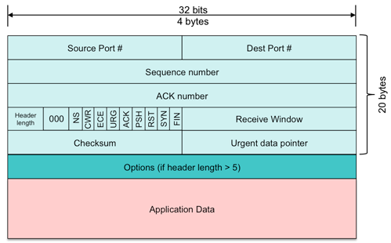

# Examen final Informática (ordinaria curso 2020-2021)

Esta prueba puntúa 40 puntos sobre 100.  Consta de tres ejercicios, el primero puntúa hasta 20 puntos y el resto 10 puntos cada uno. No se deben entregar ejercicios con errores sintácticos.

**¡IMPORTANTE! Para evitar copias no se corregirá más de un ejercicio en cada commit.  Por tanto es IMPRESCINDIBLE realizar commits tan pronto como se complete algún ejercicio.**

## 1. Listas anidadas a listas hipercubo (50%)

El objetivo de este ejercicio es transformar una lista anidada que se proporciona como entrada, en una lista hipercubo, que es un caso particular de lista anidada donde todos los elementos en cada nivel de anidamiento tienen el mismo tamaño.  Se trata de un ejercicio típico para ejercitar la recursión y algoritmos básicos.  Necesitarás visualizar varios aspectos de este problema para ser capaz de resolverlo de forma eficiente.  Una solución trivial probablemente no pasará algunos tests.  Habrá tests con listas anidadas de dimensión y tamaño hasta 10.

Para ayudar a centrar el problema se proporcionan una serie de definiciones.

### 1.1. Definiciones

#### Lista anidada

Una lista anidada es una lista que puede contener elementos que no son listas o más listas anidadas como elementos. Éstos son algunos ejemplos de listas anidadas.

```python
[[2, 3], 4, 5, 6, [2, [2, 3, 4, 5], 2, 1, 2], [[[[1]]]], []]
[[[]]]
[1, 2]
[[], []]
[4, 5, 6, 7, [], 2]
[]
```

Un elemento de una lista anidada es un *elemento básico* cuando no es una lista.  La dimensión de una lista anidada es la profundidad máxima de la lista (niveles de anidamiento). El tamaño de una lista anidada se define como la máxima longitud de entre la propia lista y cualquiera de sus elementos.  Por ejemplo, la dimensión y el tamaño de las listas anidadas de los ejemplos de arriba son:

```python
[[2, 3], 4, 5, 6, [2, [2, 3, 4, 5], 2, 1, 2], [[[[1]]]], []]  # dimensión: 5, tamaño: 7
[[[]]]                                                        # dimensión: 3, tamaño: 1
[1, 2]                                                        # dimensión: 1, tamaño: 2
[[], []]                                                      # dimensión: 2, tamaño: 2
[4, 5, 6, 7, [], 2]                                           # dimensión: 2, tamaño: 6
[]                                                            # dimensión: 1, tamaño: 0
```

#### Hipercubo

Una lista hipercubo 1-dimensional de tamaño *n* es una lista anidada de dimensión 1 y tamaño *n*.
Una lista hipercubo d-dimensional de tamaño *n* es una lista anidada de dimensión *d* y tamaño *n* tal que la lista anidada tiene *n* elementos, cada uno de los cuales es una lista hipercubo (d - 1)-dimensional de tamaño *n*.
Veamos algunos ejemplos de listas hipercubo.

```python
[1]                                                       # dimensión: 1, tamaño: 1
[[1, 2], [3, 4]]                                          # dimensión: 2, tamaño: 2
[[1, 2, 3], [4, 5, 6], [7, 8, 9]]                         # dimensión: 2, tamaño: 3
[[0]]                                                     # dimensión: 2, tamaño: 1
[[[0, 0], [1, 1]], [[2, 2], [3, 3]]]                      # dimensión: 3, tamaño: 2
[1, 2, 3, 4]                                              # dimensión: 1, tamaño: 4
[[1, 2, 3, 4], [1, 2, 3, 4], [1, 2, 3, 4], [1, 2, 3, 4]]  # dimensión: 2, tamaño: 4
```

### 1.2. La tarea

Tu tarea es implementar la función `normalize` que convierte cualquier lista anidada que recibe commo primer argumento en una lista hipercubo con la misma dimensión y el mismo tamaño que la lista anidada original, extendiendo y creciendo con un *valor de crecimiento* que se indica como segundo argumento, y cuyo valor por defecto debe ser 0.

#### Algoritmo

En la mayor parte de los escenarios encontrarás una lista anidada que no tiene elementos del mismo tamaño. Al trabajar con este tipo de listas el algoritmo debe comportarse como sigue.

* Si una lista hipercubo de dimensión 1 necesita elementos extra, añade el número necesario de elementos con el *valor de crecimiento*.
* Si una lista hipercubo de dimensión mayor que 1 tiene un elemento básico como hijo directo, reemplázalo con la lista hipercubo necesaria en la que todos sus elementos básicos tienen el valor del elemento reemplazado.
* Si una lista hipercubo de dimensión mayor que 1 necesita elementos adicionales, añade la lista hipercubo necesaria con todos sus elementos básicos iguales al *valor de crecimiento*.

Presta mucha atención al siguiente ejemplo, será muy útil para entender las dificultades del algoritmo.

```python
>>> normalize(
        [
            [
                [2, 3, 4],
                [1, 2],
                2,
                [1]
            ],
            [
                2,
                [2, 3],
                1,
                4,
                [2, 2, 6, 7]
            ],
            5
        ]
    )
```

Devuelve el siguiente resultado.

```python
[
    [
        [2, 3, 4, 0, 0],
        [1, 2, 0, 0, 0],
        [2, 2, 2, 2, 2],
        [1, 0, 0, 0, 0],
        [0, 0, 0, 0, 0]
    ],
    [
        [2, 2, 2, 2, 2],
        [2, 3, 0, 0, 0],
        [1, 1, 1, 1, 1],
        [4, 4, 4, 4, 4],
        [2, 2, 6, 7, 0]
    ],
    [
        [5, 5, 5, 5, 5],
        [5, 5, 5, 5, 5],
        [5, 5, 5, 5, 5],
        [5, 5, 5, 5, 5],
        [5, 5, 5, 5, 5]
    ],
    [
        [0, 0, 0, 0, 0],
        [0, 0, 0, 0, 0],
        [0, 0, 0, 0, 0],
        [0, 0, 0, 0, 0],
        [0, 0, 0, 0, 0]
    ],
    [
        [0, 0, 0, 0, 0],
        [0, 0, 0, 0, 0],
        [0, 0, 0, 0, 0],
        [0, 0, 0, 0, 0],
        [0, 0, 0, 0, 0]
    ]
]
```

## 2. Ecuaciones diofánticas (25%)

En matemáticas, una *ecuación diofántica* es una ecuación polinómica, normalmente con dos o más incógnitas, en la cual solo se buscan o estudian las soluciones enteras.

En este ejercicio se busca implementar la función `sol_equa` para encontrar todos los enteros *x*, *y* () que son solución de la ecuación diofántica siguiente:


donde las incógnitas son *x* e *y*, y.  El término *n* es un número entero positivo que se proporciona como argumento.

Las soluciones deben estar ordenadas en orden decreciente de los posibles valores de *x*.

Si no hay soluciones enteras debe devolver `[]`.  Mira el archivo `test_exam.py` para ver ejemplos de valores de retorno.

### 2.1. Ejemplos

```python
>>> sol_equa(90005)
[[45003, 22501], [9003, 4499], [981, 467], [309, 37]]
>>> sol_equa(90002)
[]
```

### 2.2. Sugerencia


## 3. Codificación de cabecera IPv4 (25%)

Una cabecera TCP es una secuencia de octetos como muestra la figura. No es necesario que conozcas nada sobre el protocolo TCP/IP salvo este esquema.



**NOTA: Recuerda que el bit menos significativo se representa a la derecha y el más significativo a la izquierda.**

Implementa una función `decode_tcp` que recibe un entero largo con los bits correspondientes a una cabecera TCP y devuelve un diccionario con los siguientes elementos.

Nombre (cadena) | Significado
:-- | :---
`src_port` | Número de 16 bits que contiene el puerto origen (*Source port #* en la imagen)
`dst_port` | Número de 16 bits que contiene el puerto origen (*Destination port #* en la imagen)
`seq_nr` | Número de 32 bits que contiene el número de secuencia (*Sequence number* en la imagen)
`ack_nr` | Número de 32 bits que contiene el número de reconocimiento (*ACK number* en la imagen)
`recv_wnd` | Número de 16 bits que define el tamaño de la ventana de recepción (*Receive Window* en la imagen)
`checksum` | Número de 16 bits que contiene la suma de comprobación (*Checksum* en la imagen)

Consulta el archivo `test_exam.py` para ver algunos ejemplos. Ten presente que la evaluación utilizará otros ejemplos.
